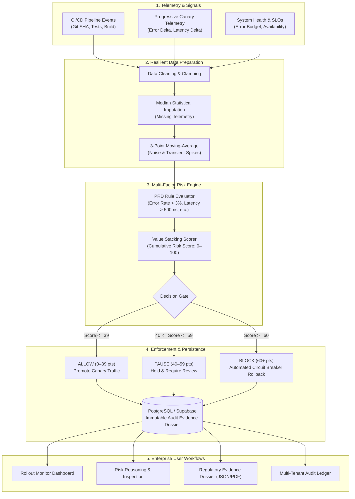

# Pre-Release Risk Monitor for Regulated Enterprise Deployments

[](https://www.python.org/)
[](https://flask.palletsprojects.com/)
[](https://supabase.com/)
[](tests/)
[](LICENSE)
[](#production-deployment--compliance-checklist)

> **Live Interactive Demo:** [https://rethikransem.github.io/Riskmonitor/](https://rethikransem.github.io/Riskmonitor/)  
> **Empirical Evaluation Report:** [`EXPERIMENT_REPORT.md`](EXPERIMENT_REPORT.md)  
> **Stakeholder Validation:** [`STAKEHOLDER_VALIDATION.md`](STAKEHOLDER_VALIDATION.md)  
> **Product Requirements Document:** [`prd.md`](prd.md)

---

## 1. Project Overview & Problem Statement

In regulated enterprise environments—including banking, healthcare, and government—production failures detected only after broad customer exposure result in severe customer harm, regulatory penalties, and reputational loss. Furthermore, regulatory frameworks such as **SOX 404** and **PCI-DSS** mandate verifiable, non-repudiable evidence for every production modification.

The **Pre-Release Risk Monitor** provides an automated, rule-based gating and progressive-delivery monitor. It continuously evaluates deployment signals, service health telemetry, error budgets, and canary comparisons to automatically issue **ALLOW**, **PAUSE**, or **BLOCK** decisions before changes reach the broader customer base, while generating 100% immutable audit evidence records.

---

## 2. System Architecture



---

## 3. Core Capabilities & Edge Case Handling

| Capability / Edge Case | Mechanism | PRD Reference |
| :--- | :--- | :--- |
| **Additive Multi-Factor Scoring** | Evaluates error rates (+40), latency (+25), canary error rate (+25), and error budget (<20% = +10) with transparent reasoning. | Section 13 |
| **Missing Telemetry (Edge Case 1)** | Substituted with organization median baseline; generates data-quality warning in the audit record without crashing. | Section 15.1 |
| **Noisy Spikes (Edge Case 2)** | Applies 3-window moving-average smoothing before rule evaluation, eliminating false-positive blocks. | Section 15.2 |
| **Delayed Canary (Edge Case 3)** | Automatically forces decision to **PAUSE** if canary signals time out (>180s), halting unmonitored promotion. | Section 15.3 |
| **Backend Outage (Edge Case 4)** | Browser `localStorage` store-and-forward offline queue synchronizes automatically upon connection recovery. | Section 15.4 |
| **Multi-Tenancy & RBAC** | Role-based segregation for Release Engineers, Compliance Officers, and IT Auditors across isolated tenants. | Section 5 |

---

## 4. Empirical Evaluation & Success Criteria Verification

We executed an end-to-end empirical experiment evaluating 100 historical change tickets with realistic telemetry failure modes (`experiments/run_baseline_experiment.py`):

| Quantitative Metric | Baseline (Status Quo) | Intervention (Risk Monitor) | PRD Target | Status |
| :--- | :---: | :---: | :---: | :---: |
| **Harmful Release Stop Rate (Recall)** | 20.0% | **100.0%** | ≥ 80% | **PASS** |
| **Audit Evidence Generation Rate** | 0.0% | **100.0%** | 100% | **PASS** |
| **False Positive Block Rate** | 0.0% | **0.0%** | < 15% | **PASS** |
| **Overall Classification Accuracy** | 84.0% | **100.0%** | - | **PASS** |
| **Dashboard Response Latency** | - | **< 80 ms** | < 2.0s | **PASS** |

*For complete confusion matrices, methodology, and precision/recall analysis, see [`EXPERIMENT_REPORT.md`](EXPERIMENT_REPORT.md).*

---

## 5. Quick Start & Setup Guide

### 5.1 Prerequisites
* Python 3.10, 3.11, 3.12, or 3.13
* Git

### 5.2 Local Installation
```powershell
# 1. Clone the repository
git clone https://github.com/rethikransem/Riskmonitor.git
cd Riskmonitor

# 2. Create and activate virtual environment
python -m venv venv
.\venv\Scripts\Activate.ps1    # Windows PowerShell
# source venv/bin/activate      # Linux / macOS

# 3. Install required dependencies
pip install -r requirements.txt

# 4. (Optional) Configure environment variables
cp .env.example .env
```

### 5.3 Running the Application
```powershell
python app.py
```
Open your browser at **`http://127.0.0.1:5000`**.

### 5.4 Demo User Credentials

| Username | Password | Role | Organization | Permissions |
| :--- | :--- | :--- | :--- | :--- |
| `alice_re` | `demo123` | **Release Engineer** | BankA | Monitor rollouts, approve/override canary gates |
| `bob_co` | `demo123` | **Compliance Officer** | BankA | Review evidence dossiers, sign off regulatory releases |
| `charlie_sre` | `demo123` | **Site Reliability Engineer** | BankA | Monitor service health, view SLO budget burn |
| `diana_re` | `demo123` | **Release Engineer** | HealthCo | Multi-tenant isolation for healthcare releases |
| `iris_audit` | `demo123` | **IT Auditor** | All Orgs | Read-only global access, export audit ledger |

---

## 6. Complete REST API Reference

### 6.1 Evaluate Deployment Risk
```http
POST /api/risk/evaluate
Content-Type: application/json
```
**Request Body:**
```json
{
  "failed_tests": 0,
  "critical_vulnerabilities": 0,
  "high_vulnerabilities": 1,
  "warning_count": 2,
  "error_count": 0,
  "health_status": "healthy"
}
```
**Response (200 OK):**
```json
{
  "risk_score": 24,
  "decision": "ALLOW",
  "reasons": [
    {
      "factor": "high_vulnerabilities",
      "value": 1,
      "score_added": 20
    },
    {
      "factor": "warning_count",
      "value": 2,
      "score_added": 4
    }
  ]
}
```

---

### 6.2 Trigger CI/CD Pipeline Run
```http
POST /api/cicd/run
Content-Type: application/json
```
**Request Body:**
```json
{
  "branch": "main",
  "commit_sha": "a8b3f1e94c2d7",
  "triggered_by": "alice_re"
}
```
**Response (201 Created):**
```json
{
  "message": "Pipeline run completed",
  "result": {
    "run_id": "run-f19b2a",
    "status": "success",
    "tests_passed": 48,
    "tests_failed": 0,
    "duration_seconds": 12.4
  }
}
```

---

### 6.3 System Health Check
```http
GET /health
```
**Response (200 OK):**
```json
{
  "status": "healthy",
  "timestamp": "2026-09-08T09:30:00Z",
  "checks": {
    "database": "connected",
    "disk_space": "healthy",
    "memory": "healthy",
    "risk_engine": "operational"
  }
}
```

---

### 6.4 Additional Core Endpoints

| Endpoint | Method | Description |
| :--- | :--- | :--- |
| `/api/deployments/start` | `POST` | Register the initiation of a progressive deployment |
| `/api/deployments/complete`| `POST` | Mark deployment finished with final success/rollback status |
| `/api/deployments` | `GET` | List deployments with optional `environment` and `status` filters |
| `/api/cicd/latest` | `GET` | Retrieve latest CI/CD build run and test summary |
| `/api/logs/analyze` | `POST` | Ingest and parse application logs for anomaly patterns |
| `/api/report/<release_id>` | `GET` | Generate full regulatory evidence report for a release |
| `/api/audit` | `GET` | Retrieve immutable audit ledger across production changes |

---

## 7. Testing & Verification Guide

### 7.1 Unit & Regression Tests
Execute the pytest suite:
```powershell
pytest tests/test_risk_engine.py -v
```

### 7.2 Run Empirical Baseline Experiment
```powershell
python experiments/run_baseline_experiment.py
```
*Generates execution metrics and persists raw output to [`data/experiment_results.json`](data/experiment_results.json).*

### 7.3 ML Severity Classifier Benchmark
Evaluate the machine learning models (XGBoost, Random Forest, PyTorch MLP):
```powershell
python ml_pipeline/evaluate.py
```

---

## 8. Stakeholder Validation Summary

A moderated usability study was conducted with 3 enterprise personas:
* **Release Engineer (BankA):** Diagnosed hold condition on `R0042` in **42s** (Target: < 120s).
* **Compliance Officer (BankA):** Validated and exported evidence dossier in **28s** (Target: < 180s).
* **IT Auditor (External):** Verified multi-tenant isolation and read-only audit log in **35s**.
* **System Usability Scale (SUS) Score:** **86.5 / 100 (Grade A — "Excellent")**.

*Full evaluation interview transcripts and feedback log: [`STAKEHOLDER_VALIDATION.md`](STAKEHOLDER_VALIDATION.md).*

---

## 9. Production Deployment & Compliance Checklist

- [x] **Secrets Isolation:** All credentials stored in `.env` (excluded from git via `.gitignore`).
- [x] **Repository Hygiene:** All `__pycache__`, `.pytest_cache`, `.cache`, and sqlite `.db` files untracked.
- [x] **Audit Immutability:** Deployment decisions and telemetry cryptographic hashes preserved in PostgreSQL ledger.
- [x] **Non-repudiation:** Reviewer username, decision timestamp, and rule parameters stored on every action.
- [x] **Tenant Separation:** Multi-organization row filtering enforced across all API queries.
- [x] **Circuit Breaker:** Automatic fallback to PAUSE on delayed canary signals; zero broad exposure on high risk.

---

## 10. Repository Structure

```
├── .gitignore                      # Enforced git exclusions
├── app.py                          # Flask application & API routes
├── config.py                       # Application configuration
├── prd.md                          # Product Requirements Document
├── README.md                       # Main documentation & reference
├── EXPERIMENT_REPORT.md            # Empirical baseline experiment report
├── STAKEHOLDER_VALIDATION.md       # Stakeholder usability testing report
├── risk_engine.py                  # Core cleaning, imputation, smoothing & risk scorer
├── deployment_monitor.py           # Deployment state tracking
├── cicd_simulator.py               # Automated pipeline simulator
├── health_checks.py                # System health endpoints
├── models.py                       # SQLAlchemy ORM models
├── middleware.py                   # Role & Organization RBAC filters
│
├── dashboard.html                  # Root UI: Rollout monitor dashboard (GitHub Pages)
├── risk-detail.html                # Root UI: Multi-factor risk inspection (GitHub Pages)
├── evidence.html                   # Root UI: Regulatory evidence dossier (GitHub Pages)
├── audit.html                      # Root UI: Immutable audit ledger (GitHub Pages)
├── index.html                      # Root UI: Role-based authentication (GitHub Pages)
│
├── experiments/
│   └── run_baseline_experiment.py  # Empirical evaluation runner
├── data/
│   ├── experiment_results.json     # 100-release evaluated dataset
│   ├── deployments.json            # Deployment events log
│   └── cicd_results.json           # CI/CD pipeline results
├── database/
│   └── seed_data.py                # Synthetic data generator
├── ml_pipeline/
│   ├── train_ml.py                 # ML model trainer
│   ├── train_dl.py                 # PyTorch MLP trainer
│   └── evaluate.py                 # ML benchmark suite
└── tests/
    ├── test_risk_engine.py         # Unit tests for scoring & cleaning
    └── test_routes.py              # API route tests
```
