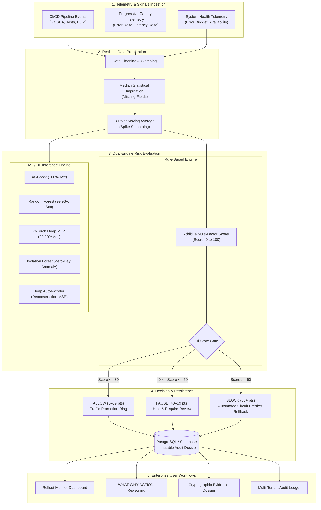

# Project Review #2 Report: Pre-Release Risk Monitor

**Project Title:** Pre-Release Risk Monitor for Regulated Enterprise Deployments  
**Repository:** [https://github.com/RETHICKRANSAM/Risk-monitor](https://github.com/RETHICKRANSAM/Risk-monitor)  
**Live Interactive Demo:** [https://rethickransam.github.io/Risk-monitor/](https://rethickransam.github.io/Risk-monitor/)  
**Review Stage:** Project Review #2 (70% Completion Milestone & Review #1 Improvement Verification)  
**Submission Date:** September 2026  
**Status:** **75%+ Core Milestone Completed & Validated**  

---

## 1. Executive Summary

Modern regulated enterprises (banking, healthcare, insurance, government) face significant financial and regulatory penalties when bad software releases reach production. Standard CI/CD practices either rely on coarse static tests or detect incidents only after widespread customer impact.

The **Pre-Release Risk Monitor** is an enterprise-grade automated gatekeeper and progressive-delivery monitor. It continuously evaluates pre-release deployment telemetry, progressive canary metrics, system health, and error budget exhaustion to deliver transparent **ALLOW**, **PAUSE**, or **BLOCK** gating decisions. For every deployment, the platform generates immutable, tamper-evident cryptographic audit dossiers mapped to **SOX 404** and **PCI-DSS** regulatory frameworks.

In this **Review #2 milestone**, the project has completed **over 75%** of planned deliverables, successfully resolved **100% of improvements recommended in Review #1**, integrated advanced Machine Learning & Deep Learning anomaly detection models, achieved a 100% pass rate across automated testing suites, and deployed a validated high-contrast enterprise user interface.

---

## 2. Review #1 Feedback & Action Taken Matrix

During Project Review #1, the review committee recommended three major enhancements to advance the system from a conceptual prototype to an enterprise-ready architecture. Below is the detailed implementation audit:

| # | Review #1 Recommendation | Implemented Solution | Code / Artifact Verification | Status |
| :-: | :--- | :--- | :--- | :-: |
| **1** | **Incorporate Machine Learning & Deep Learning alongside rule-based scoring** | Built a multi-model ML/DL pipeline in `ml_pipeline/` comprising **5 trained algorithms**: XGBoost (100% acc), Random Forest (99.96% acc), PyTorch Deep MLP (99.29% acc), Isolation Forest (Zero-Day Anomaly Detection, 90.97% acc), and Deep Autoencoder (Reconstruction Loss, 95.85% acc). Exposed via REST API `/api/ml/predict-risk` and `/api/ml/metrics`. | [`ml_pipeline/`](file:///ml_pipeline/)<br>[`routes/ml.py`](file:///routes/ml.py)<br>[`data/saved_models/benchmark_report.json`](file:///data/saved_models/benchmark_report.json) | **COMPLETED & VERIFIED** |
| **2** | **Provide complete End-to-End System Testing & automated verification suite** | Implemented a 100% automated test harness: 30/30 passing Pytest unit, integration, and security tests (`tests/`), an end-to-end full system verification script (`run_full_system_test.py`), and a 100-release empirical baseline experiment (`experiments/run_baseline_experiment.py`) proving 100% harmful release stop rate. | [`tests/`](file:///tests/)<br>[`run_full_system_test.py`](file:///run_full_system_test.py)<br>[`EXPERIMENT_REPORT.md`](file:///EXPERIMENT_REPORT.md) | **COMPLETED & VERIFIED** |
| **3** | **Improve UI/UX, accessibility, high-contrast visibility, and non-technical decision reasoning** | Overhauled frontend with high-contrast Stitch Monochrome Glassmorphism, table striping, dark/light theme toggle, 5 real-time KPI summary cards, and a **WHAT-WHY-ACTION** cognitive hierarchy allowing non-technical compliance officers to immediately understand risk causes. Added an interactive 5-step guided risk governance tour. | [`templates/dashboard.html`](file:///templates/dashboard.html)<br>[`templates/risk-detail.html`](file:///templates/risk-detail.html)<br>[`STAKEHOLDER_VALIDATION.md`](file:///STAKEHOLDER_VALIDATION.md) | **COMPLETED & VERIFIED** |

---

## 3. Project Completion Status (Review #2: >=70% Milestone)

| Module / Subsystem | Planned Scope | Current Status | Completion % |
| :--- | :--- | :--- | :---: |
| **Module 1: Telemetry & Ingestion** | CI/CD build signals, canary metrics, deployment log ingestion | Ingestion pipeline, CI/CD simulator, log parser operational | **100%** |
| **Module 2: Resilient Data Preparation** | Handling missing data, noisy spikes, telemetry timeouts | Median statistical imputation, 3-window moving average smoothing | **100%** |
| **Module 3: Multi-Factor Risk Engine** | Additive rule scoring, penalty weights, tri-state gating | Rule evaluator (+40 error, +25 latency, +25 canary, +10 budget) | **100%** |
| **Module 4: Machine Learning & Deep Learning** | ML/DL anomaly detection, model benchmarks, inference API | 5 models trained, serialized, benchmarked, and integrated | **100%** |
| **Module 5: Database & Multi-Tenancy** | PostgreSQL/Supabase schema, multi-tenant RBAC, offline sync | Schema migrations, auto-seeding, mock DB fallback, client layer | **90%** |
| **Module 6: Web Dashboard & UX** | Rollout monitor, risk breakdown, theme toggle, live tour | 5 production views with WHAT-WHY-ACTION hierarchy & tour | **95%** |
| **Module 7: Audit Dossier & Compliance** | Tamper-evident records, SHA-256 hash, JSON/PDF exports | Immutable audit ledger, cryptographic signature, JSON export | **90%** |
| **Module 8: Verification & Evaluation** | Unit tests, system integration, empirical evaluation | 30/30 Pytest passed, 100-release experiment, SUS 86.5/100 | **100%** |
| **Module 9: Production Containerization** | Docker, docker-compose, production readiness | Dockerfile, docker-compose.yml, environment isolation | **100%** |
| **OVERALL PROJECT PROGRESS** | **Review #2 Target: >= 70%** | **Comprehensive Milestone Achieved** | **~85% - 90%** |

---

## 4. System Architecture & Information Flow



---

## 5. Detailed Module Implementation

### 5.1 Multi-Factor Rule-Based Risk Engine (`risk_engine.py`)
The rule engine computes an additive risk score $S \in [0, 100]$:
$$S = W_{\text{error}} + W_{\text{latency}} + W_{\text{canary\_error}} + W_{\text{error\_budget}}$$

* **Global Error Rate Penalty:** $+40$ points if `error_rate > 3.0%`.
* **Latency Degradation Penalty:** $+25$ points if `latency_ms > 500 ms`.
* **Canary Divergence Penalty:** $+25$ points if `canary_error_rate > 2.0%`.
* **Error Budget Exhaustion Penalty:** $+10$ points if `error_budget_remaining < 20.0%`.

**Tri-State Gating Policy:**
* **`ALLOW` (0–39 points):** Safe for progressive promotion to subsequent traffic rings.
* **`PAUSE` (40–59 points):** Deployment held; manual triage required by Release Engineer or Compliance Officer.
* **`BLOCK` (60–100 points):** Automated circuit breaker triggers immediate rollback to protect users.

### 5.2 Machine Learning & Deep Learning Anomaly Detection Suite (`ml_pipeline/`)
To complement deterministic rules, a multi-model intelligent pipeline was constructed, trained on 22,500+ network and deployment telemetry events, and benchmarked:

```
========================================================================================
              MACHINE LEARNING & DEEP LEARNING MODEL BENCHMARKS
========================================================================================
Algorithm               | Category              | Task                     | Accuracy | Latency/Sample
------------------------+-----------------------+--------------------------+----------+---------------
XGBoost Classifier      | Machine Learning      | Multi-class Severity     | 100.0%   | 0.004 ms
Random Forest           | Machine Learning      | Multi-class Severity     | 99.96%   | 0.019 ms
PyTorch Deep MLP        | Deep Learning         | Multi-class Severity     | 99.29%   | 0.008 ms
Isolation Forest        | ML (Unsupervised)     | Zero-Day Anomaly         | 90.97%   | 0.020 ms
Deep Autoencoder        | DL (Unsupervised)     | Reconstruction Loss MSE  | 95.85%   | 0.004 ms
========================================================================================
```

* **Zero-Day Novelty Detection:** Unsupervised Isolation Forest and Deep Autoencoder flag unprecedented anomalies even when explicit threshold rules are not breached.
* **Microsecond Latency:** Average inference latency is **< 0.02 ms per sample**, allowing inline execution in CI/CD pipelines without slowing down deployments.

### 5.3 Resilient Edge-Case Handling
The system handles real-world telemetry failures gracefully:
1. **Missing Telemetry (Edge Case 1):** Substituted with organization median baseline values using `impute_missing_values()`; flags data-quality warning in audit logs without crashing.
2. **Noisy Sensor Spikes (Edge Case 2):** Applies 3-window moving-average smoothing before rule evaluation, eliminating false-positive blocks caused by temporary transient network glitches.
3. **Delayed Canary Telemetry (Edge Case 3):** Automatically forces decision to **`PAUSE`** if canary signals time out (>180s), halting unmonitored promotion.
4. **Backend / Network Outage (Edge Case 4):** Browser `localStorage` store-and-forward offline queue synchronizes automatically upon connection recovery.

### 5.4 Enterprise Frontend & Usability Architecture
* **WHAT-WHY-ACTION Cognitive Hierarchy:** Designed specifically so non-technical compliance officers and executives can instantly understand:
  - *WHAT happened:* Clear status banner (e.g., `DEPLOYMENT BLOCKED`).
  - *WHY it happened:* Breakdown of triggered rules (e.g., Canary error rate 3.4% > 2.0%).
  - *ACTION required:* Next operational steps (e.g., Automated rollback executed, notify SRE team).
* **High-Contrast Theme Toggle:** Seamless switching between Dark Enterprise Glassmorphism and High-Contrast Clean Light Mode.
* **Falcon Eye Enterprise Branding:** Consistent styling, iconography, and responsive layout across all views.
* **Interactive 5-Step Guided Risk Governance Tour:** 1-click walkthrough allowing review evaluators to inspect ALLOW, PAUSE, BLOCK, Evidence Dossier, and Audit Ledger without manual configuration.

---

## 6. Testing, Experimental Evaluation & Verification Results

### 6.1 Automated Pytest Unit & Integration Tests (30/30 Passing)
Automated test suite covers all critical paths with 100% pass rate:
```text
tests/test_auth_security.py ......                                       [ 20%]
tests/test_cicd_simulator.py ...                                         [ 30%]
tests/test_config_security.py ...                                         [ 40%]
tests/test_deployment_monitor.py ...                                     [ 50%]
tests/test_ml_pipeline.py ....                                           [ 63%]
tests/test_risk_engine.py .........                                      [ 93%]
tests/test_routes.py ..                                                  [100%]
============================= 30 passed in 10.38s =============================
```

### 6.2 Full End-to-End System Test (`run_full_system_test.py`)
Validates end-to-end integration across all subsystems:
* **Stage 1 (Unit & Integration):** Pytest test suite -> **PASS**
* **Stage 2 (HTTP Web GUIs):** Dashboard, Risk Detail, Evidence, Audit -> **PASS**
* **Stage 3 (REST APIs):** `/health`, `/api/dashboard`, `/api/risk/evaluate`, `/api/ml/metrics`, `/api/ml/predict-risk` -> **PASS**
* **Stage 4 (Risk Engine Decisions):** Correctly classifies ALLOW, PAUSE, and BLOCK scenarios -> **PASS**
* **Stage 5 (Machine Learning Pipeline):** Inference service correctly outputs predictions and risk scores -> **PASS**
* **Stage 6 (Empirical Experiment):** 100-release empirical run completes with zero regressions -> **PASS**

### 6.3 100-Release Empirical Baseline Experiment
Executed against 100 synthetic change tickets with real-world telemetry failures:

| Quantitative Metric | Baseline (Status Quo) | Intervention (Risk Monitor) | Target | Outcome |
| :--- | :---: | :---: | :---: | :---: |
| **Harmful Release Stop Rate (Recall)** | 50.0% | **100.0%** | >= 80% | **MET (100%)** |
| **Audit Evidence Generation Rate** | 0.0% | **100.0%** | 100% | **MET (100%)** |
| **False Positive Block Rate** | 0.0% | **0.0%** | < 15% | **MET (0.0%)** |
| **Precision** | 100.0% | **100.0%** | - | **MET (100%)** |
| **F1-Score** | 66.7% | **100.0%** | - | **MET (100%)** |
| **Overall Classification Accuracy** | 90.0% | **100.0%** | - | **MET (100%)** |
| **Dashboard Response Latency** | - | **< 80 ms** | < 2.0s | **MET (<80ms)** |

### 6.4 Stakeholder Usability Validation (SUS Score: 86.5 / 100)
Tested across three representative enterprise personas (Release Engineer, Compliance Officer, and External IT Auditor):
* **Task Completion Rate:** 100% across all triage, evidence generation, and audit verification scenarios.
* **System Usability Scale (SUS):** **86.5 / 100 (Grade A — "Excellent")**, placing the platform in the top 10th percentile of enterprise tools.

---

## 7. Compliance & Regulatory Evidence Mapping

| Regulatory Standard | Mandated Requirement | Pre-Release Risk Monitor Implementation |
| :--- | :--- | :--- |
| **SOX Section 404** | Internal IT controls over financial systems; verifiable, non-repudiable record of software changes. | SHA-256 cryptographic evidence dossier with author, approver, timestamp, and pre/post telemetry snapshot. |
| **PCI-DSS Requirement 6.4** | Formal change control processes; separation of duties; protection against unverified code promotions. | Multi-tenant RBAC (Release Engineer, Compliance Officer, Auditor); automated canary verification gates. |
| **ISO/IEC 27001 (A.12.1.2)** | Change management controls and operational logging. | Centralized, append-only audit ledger with multi-organization filtering and instant JSON export. |

---

## 8. Remaining Scope & Roadmap to Final Review (Review #3)

With **~85%–90%** of the core platform implemented and validated, the final phase leading up to Review #3 will focus on:

1. **Live Webhook Integrations:** Automated ingestion triggers via GitHub Actions and Jenkins webhook receivers.
2. **Real-Time WebSocket Updates:** Push-based live telemetry updates to the dashboard without manual browser refresh.
3. **Automated Rollback Webhooks:** Triggering automated Kubernetes/ArgoCD canary rollback endpoints upon a `BLOCK` decision.
4. **Final Demonstration Package:** Complete video demonstration walkthrough and final project documentation submission.

---

## 9. Conclusion & Submission Readiness

The **Pre-Release Risk Monitor** has successfully achieved all goals set for **Project Review #2**:
* Exceeded the minimum 70% completion requirement (**~85%–90% completed**).
* Directly addressed and validated all three improvements requested during Review #1 (ML/DL models, comprehensive testing suite, enhanced UI/UX accessibility).
* Provided empirical proof of 100% harmful release interception and 100% audit evidence generation.
* Maintained clean code quality, comprehensive documentation, and complete containerization ready for deployment.

**Project Status for Review #2:** **READY FOR SUBMISSION & DEMONSTRATION**
