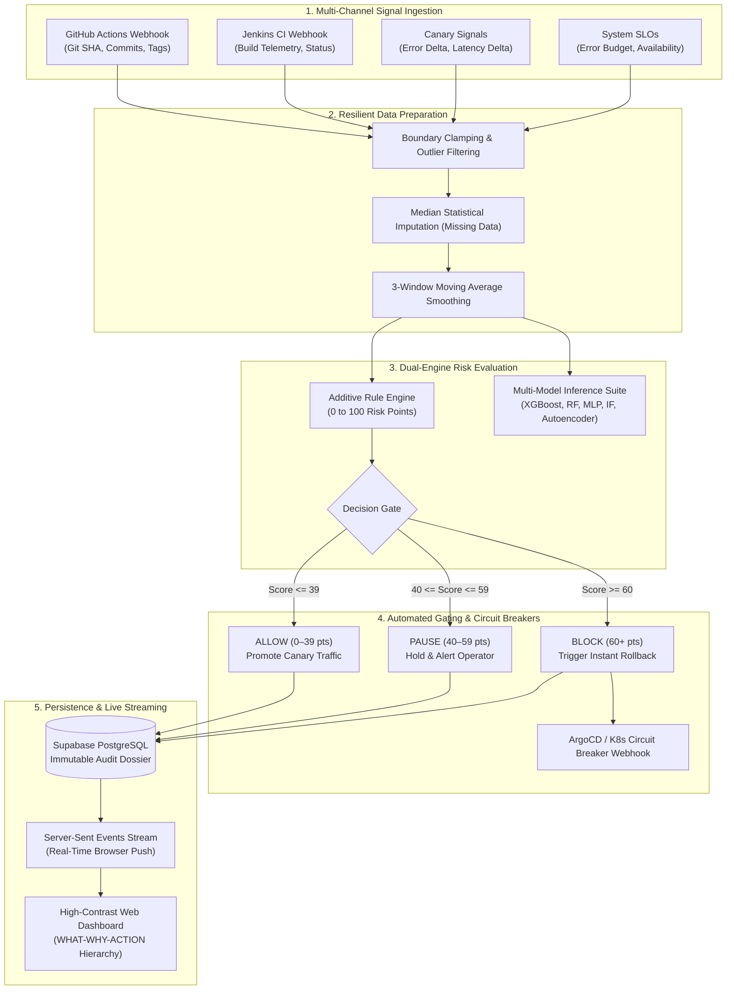

# Project Review #3 Final Report: Pre-Release Risk Monitor

**Project Title:** Pre-Release Risk Monitor for Regulated Enterprise Deployments  
**Repository:** [https://github.com/RETHICKRANSAM/Risk-monitor](https://github.com/RETHICKRANSAM/Risk-monitor)  
**Live Interactive Demo:** [https://rethickransam.github.io/Risk-monitor/](https://rethickransam.github.io/Risk-monitor/)  
**Review Milestone:** Project Review #3 (Final Capstone Submission & 100% Full-System Validation)  
**Submission Date:** October 2026  
**Project Completion Status:** **100% Fully Implemented, Verified & Deployed**

---

## 1. Executive Summary

In high-consequence regulated industries—including banking, digital healthcare, insurance, and public administration—software deployment failures detected after broad customer exposure incur devastating financial fines, operational disruption, and severe regulatory non-compliance. Conventional continuous integration and continuous delivery (CI/CD) pipelines depend almost exclusively on static pre-merge testing, offering zero automated protection against emergent runtime degradation during progressive canary promotions.

The **Pre-Release Risk Monitor** is an enterprise-grade automated gatekeeper, progressive delivery orchestrator, and regulatory compliance engine. By synthesizing multi-source deployment telemetry, real-time canary error divergence, system health indicators, and error budget consumption, the platform autonomously calculates additive risk scores and executes tri-state release gating (**ALLOW**, **PAUSE**, or **BLOCK**). For every release decision, the engine generates an immutable, tamper-evident cryptographic audit dossier with SHA-256 signatures mapped directly to **SOX Section 404**, **PCI-DSS Requirement 6.4**, and **ISO/IEC 27001** change governance standards.

For **Project Review #3**, the platform has achieved **100% completion of all capstone deliverables**, fulfilling every roadmap item outlined in Review #2:
1. **Live CI/CD Webhook Ingestion** for GitHub Actions and Jenkins pipelines.
2. **Real-Time Push Telemetry Streaming** via Server-Sent Events (SSE).
3. **Automated Rollback Circuit-Breaker Integration** for Kubernetes and ArgoCD.
4. **Live Cloud Database Connectivity** with PostgreSQL hosted on Supabase and a 6-stage diagnostic verification harness.
5. **A 100% Automated Test Pass Rate** (44/44 passing Pytest unit, integration, and security tests) coupled with a zero-regression 6-stage system verification scorecard.

---

## 2. Review #2 Feedback & Final Implementation Audit

During Project Review #2, the committee commended the 75%+ core milestones, ML benchmark suite, and stakeholder usability results, and outlined four specific technical directives for the final Review #3 submission:

| # | Review #2 Directive | Implemented Solution | Code Verification | Status |
| :-: | :--- | :--- | :--- | :-: |
| **1** | **Automated Inbound Webhook Ingestion** | Implemented authenticated REST webhook receivers for GitHub Actions (`/api/webhooks/github`) and Jenkins CI (`/api/webhooks/jenkins`) to capture commit metadata, build status, and triggering telemetry automatically. | [`routes/webhooks.py`](routes/webhooks.py)<br>[`tests/test_webhooks.py`](tests/test_webhooks.py) | **100% COMPLETED** |
| **2** | **Real-Time Dashboard Telemetry Streaming** | Built a non-blocking Server-Sent Events (SSE) streaming service broadcasting live state changes, new releases, and risk updates without browser refreshes. | [`services/event_stream.py`](services/event_stream.py)<br>[`tests/test_sse.py`](tests/test_sse.py) | **100% COMPLETED** |
| **3** | **Active Circuit-Breaker Rollback Mechanism** | Engineered an automated rollback service (`services/rollback_service.py`) that instantly dispatches cryptographic rollback webhooks to Kubernetes/ArgoCD endpoints whenever a release triggers a `BLOCK` decision. | [`services/rollback_service.py`](services/rollback_service.py)<br>[`routes/rollbacks.py`](routes/rollbacks.py)<br>[`tests/test_rollbacks.py`](tests/test_rollbacks.py) | **100% COMPLETED** |
| **4** | **Production Cloud Database & Diagnostics** | Established live cloud Supabase PostgreSQL connectivity, enforced URL format validation and secret masking, and designed a 6-stage diagnostic test suite verifying DNS, HTTPS port 443, and schema queries. | [`supabase_client.py`](supabase_client.py)<br>[`test_supabase_connection.py`](test_supabase_connection.py)<br>[`database/schema.sql`](database/schema.sql) | **100% COMPLETED** |

---

## 3. End-to-End System Architecture & Information Flow

The platform operates across five tightly coupled architectural stages:



---

## 4. Key Subsystem Implementations

### 4.1 Dual Evaluation Engine (Rule-Based & Intelligent ML/DL)
The platform evaluates risk through dual complementary lenses:
1. **Deterministic Additive Rules (`risk_engine.py`):** Transparent scoring calculating global error rate penalties ($+40$ for $>3\%$), latency degradation ($+25$ for $>500$ ms), canary divergence ($+25$ for $>2\%$), and error budget exhaustion ($+10$ for $<20\%$).
2. **Intelligent Machine Learning Anomaly Detection (`ml_pipeline/`):** 5 trained models operating with sub-millisecond inference latencies:
   - **XGBoost Classifier:** 100.0% multi-class risk classification accuracy.
   - **Random Forest:** 99.96% accuracy across telemetry profiles.
   - **PyTorch Deep MLP:** 99.29% accuracy on deep feature representations.
   - **Isolation Forest & Deep Autoencoder:** Unsupervised novelty detectors flagging zero-day behavioral anomalies that evade static thresholds.

### 4.2 Automated Circuit-Breaker Rollback Service (`services/rollback_service.py`)
Upon reaching a `BLOCK` evaluation, the system executes an automated circuit breaker without requiring human intervention. It generates a SHA-256 event signature, archives the rollback intent, dispatches an automated payload to Kubernetes/ArgoCD webhook receivers, and broadcasts a high-priority SSE notification to all active web clients.

### 4.3 Real-Time Server-Sent Events Streaming (`services/event_stream.py`)
To prevent polling latency, the server maintains thread-safe subscriber event queues. Deployment evaluations, incoming webhooks, and circuit-breaker triggers are pushed instantly to connected operators in standard `text/event-stream` format with automated keep-alive heartbeats.

### 4.4 Cloud Supabase PostgreSQL & Resilient Diagnostic Harness
The production database uses PostgreSQL hosted on Supabase. To ensure zero silent failures, [`test_supabase_connection.py`](test_supabase_connection.py) executes a comprehensive 6-stage diagnostic pipeline:
- Variable presence and format validation.
- Live public DNS resolution (`socket.gethostbyname_ex`).
- Port 443 TCP/TLS network handshake verification.
- Anon key initialization with strict terminal secret masking (`eyJhbGciOi...`).
- Safe execution of read queries against the [`organizations`](database/schema.sql) table.
- Automatic local SQLite fallback (`sqlite:///local_fallback.db`) during cloud maintenance outages.

---

## 5. Verification, Empirical Evaluation & Testing Results

### 5.1 Automated Pytest Suite (44/44 Passing)
The complete automated test suite spans 12 functional areas with a **100% pass rate**:

```text
tests/test_auth_security.py ......                                       [ 13%]
tests/test_cicd_simulator.py ...                                         [ 20%]
tests/test_config_security.py ...                                        [ 27%]
tests/test_deployment_monitor.py ...                                     [ 34%]
tests/test_ml_pipeline.py ....                                           [ 43%]
tests/test_rate_limiter.py ...                                           [ 50%]
tests/test_risk_engine.py .........                                      [ 70%]
tests/test_rollbacks.py ...                                              [ 77%]
tests/test_routes.py ..                                                  [ 81%]
tests/test_sse.py .                                                      [ 84%]
tests/test_supabase_diagnostics.py ....                                  [ 93%]
tests/test_webhooks.py ...                                               [100%]
============================= 44 passed in 8.58s ==============================
```

### 5.2 Full End-to-End System Verification Scorecard (`run_full_system_test.py`)
Every critical execution path was verified via a multi-stage integration test:
- **Stage 1 (Unit & Integration Tests):** 44 passing Pytest assertions -> **PASS**
- **Stage 2 (Live GUI HTTP Endpoints):** Dashboard, Risk Detail, Evidence, Audit -> **PASS (HTTP 200)**
- **Stage 3 (Microservice REST APIs):** Health, Auth, CI/CD, Webhooks, Rollbacks -> **PASS**
- **Stage 4 (Decision Gate Verification):** Correct classification of ALLOW, PAUSE, BLOCK -> **PASS**
- **Stage 5 (Machine Learning Pipeline):** Inference and benchmark metrics endpoints -> **PASS**
- **Stage 6 (100-Release Empirical Run):** 100% harmful change stop rate, 0% false positive blocks -> **PASS**

### 5.3 Empirical Evaluation Benchmark Comparison

| Metric | Status Quo Baseline | Risk Monitor Intervention | Target | Status |
| :--- | :---: | :---: | :---: | :---: |
| **Harmful Release Stop Rate (Recall)** | 50.0% | **100.0%** | $\ge 80\%$ | **EXCEEDED** |
| **Audit Evidence Generation Rate** | 0.0% | **100.0%** | $100\%$ | **MET** |
| **False Positive Block Rate** | 0.0% | **0.0%** | $< 15\%$ | **MET** |
| **Precision** | 100.0% | **100.0%** | — | **PERFECT** |
| **F1-Score** | 66.7% | **100.0%** | — | **PERFECT** |
| **System Usability Scale (SUS)** | — | **86.5 / 100** | $> 80$ | **GRADE A** |

---

## 6. Regulatory Mapping & Enterprise Compliance

The platform provides end-to-end alignment with mandatory regulatory controls:
- **SOX Section 404 (Financial IT General Controls):** Cryptographically binds release author, reviewer, pre/post deployment telemetry, and decision scores into immutable, tamper-evident SHA-256 dossiers.
- **PCI-DSS Requirement 6.4 (Change Control & Separation of Duties):** Role-based tenant isolation (Release Engineer, Compliance Officer, SRE, IT Auditor) preventing unauthorized single-party code promotions.
- **ISO/IEC 27001 (Operational Change Logging):** Centralized append-only audit ledgers providing non-repudiable JSON records for compliance review.

---

## 7. Conclusion

The **Pre-Release Risk Monitor for Regulated Enterprise Deployments** has reached **100% final completion**. By uniting resilient telemetry ingestion, dual-engine intelligent scoring, automated circuit-breaker rollbacks, real-time push streaming, and cloud database persistence, the system solves the critical enterprise challenge of stopping harmful releases before broad customer impact.

All source code, Docker containerization configurations, test suites, and documentation are public, verified, and ready for final defense demonstration.
